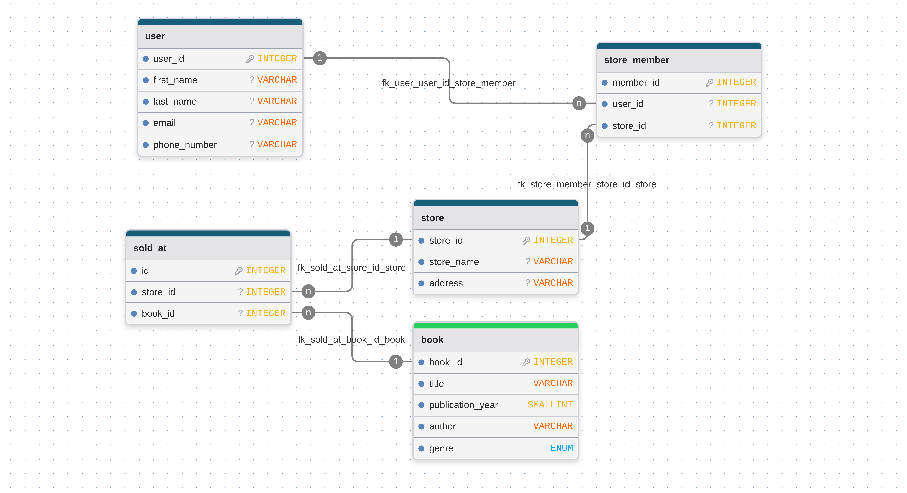
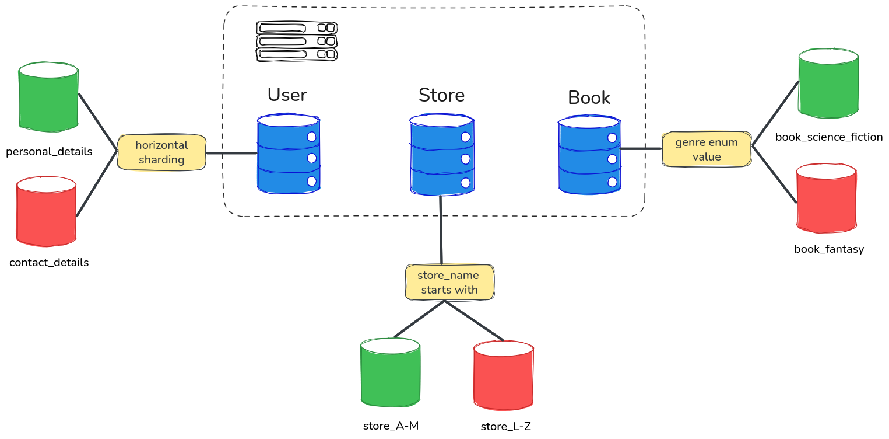
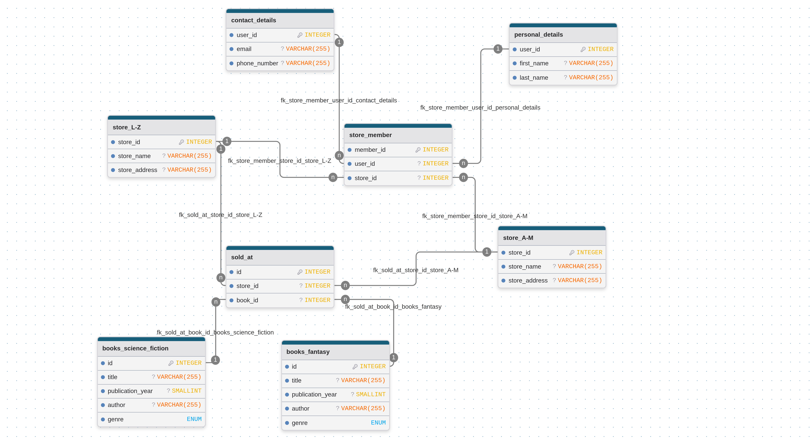

# Домашнее задание к занятию "`Введение в SQL`" - `Левковец Ирина`

### Инструкция по выполнению домашнего задания

   1. Сделайте `fork` данного репозитория к себе в Github и переименуйте его по названию или номеру занятия, например, https://github.com/имя-вашего-репозитория/git-hw или  https://github.com/имя-вашего-репозитория/7-1-ansible-hw).
   2. Выполните клонирование данного репозитория к себе на ПК с помощью команды `git clone`.
   3. Выполните домашнее задание и заполните у себя локально этот файл README.md:
      - впишите вверху название занятия и вашу фамилию и имя
      - в каждом задании добавьте решение в требуемом виде (текст/код/скриншоты/ссылка)
      - для корректного добавления скриншотов воспользуйтесь [инструкцией "Как вставить скриншот в шаблон с решением](https://github.com/netology-code/sys-pattern-homework/blob/main/screen-instruction.md)
      - при оформлении используйте возможности языка разметки md (коротко об этом можно посмотреть в [инструкции  по MarkDown](https://github.com/netology-code/sys-pattern-homework/blob/main/md-instruction.md))
   4. После завершения работы над домашним заданием сделайте коммит (`git commit -m "comment"`) и отправьте его на Github (`git push origin`);
   5. Для проверки домашнего задания преподавателем в личном кабинете прикрепите и отправьте ссылку на решение в виде md-файла в вашем Github.
   6. Любые вопросы по выполнению заданий спрашивайте в чате учебной группы и/или в разделе “Вопросы по заданию” в личном кабинете.
   
Желаем успехов в выполнении домашнего задания!
   
### Дополнительные материалы, которые могут быть полезны для выполнения задания

1. [Руководство по оформлению Markdown файлов](https://gist.github.com/Jekins/2bf2d0638163f1294637#Code)

---

### Задание 1
Опишите основные преимущества использования масштабирования методами:

- активный master-сервер и пассивный репликационный slave-сервер;
   - Если репликационный сервер один и только master записывает данные, то это помогает избежать рассинхронизации между master-сервером и репликационным сервером
   - Уменьшается нагрузка на master при чтении так как мы можем читать из реплики
   - Такое решение проще разработать и поддерживать 
- master-сервер и несколько slave-серверов;
   - Slave-серверы не пассивные, значит любой из них может заменить master. Такое решение более отказоустойчивое
   - Нагрузка на чтение и запись распределяется между master-сервером и slave-серверами
   - Хорошая масштабируемость - мы можеи добавить больше реплик чтобы повысить производительность и отказоустойчивость

### Задание 2
Разработайте план для выполнения горизонтального и вертикального шаринга базы данных. База данных состоит из трёх таблиц:

- пользователи,
- книги,
- магазины (столбцы произвольно).
Опишите принципы построения системы и их разграничение или разбивку между базами данных.

Из трех таблиц можно составить следующую блок-схему:

- Таблица `user` состоит из пяти столбцов и ее можно вертикальным шардированием разделить на два шарда - `personal_details(user_id, first_name, last_name)` и `contact_details(user_id, email, phone_number)`
- Таблицу `book` можно разделить горизонтальным шардированием на таблицы в зависимости от жанра книги (`enum genre`)
- Таблицу `store` можно разделить горизонтальным шардированием на таблицы в зависимости от первой буквы названия магазина (`store_name`). У нас получится две таблицы: `store_A-L` и `store_A-Z` с теми же полями, что и в оригинальной таблице

В результате получаем такую новую блок-схему:
