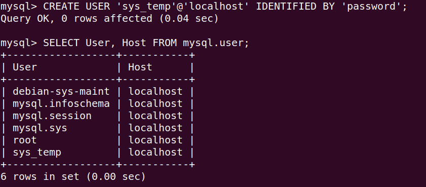
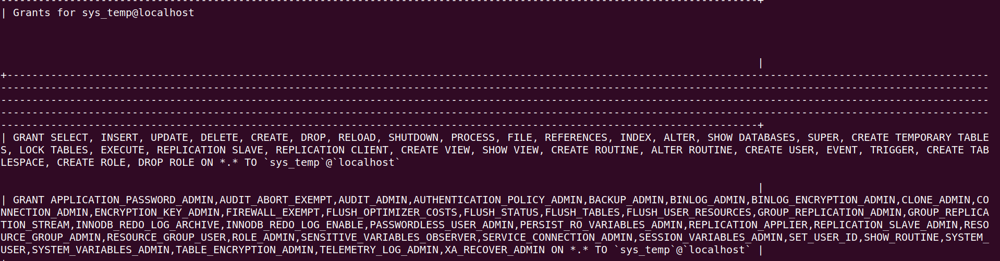
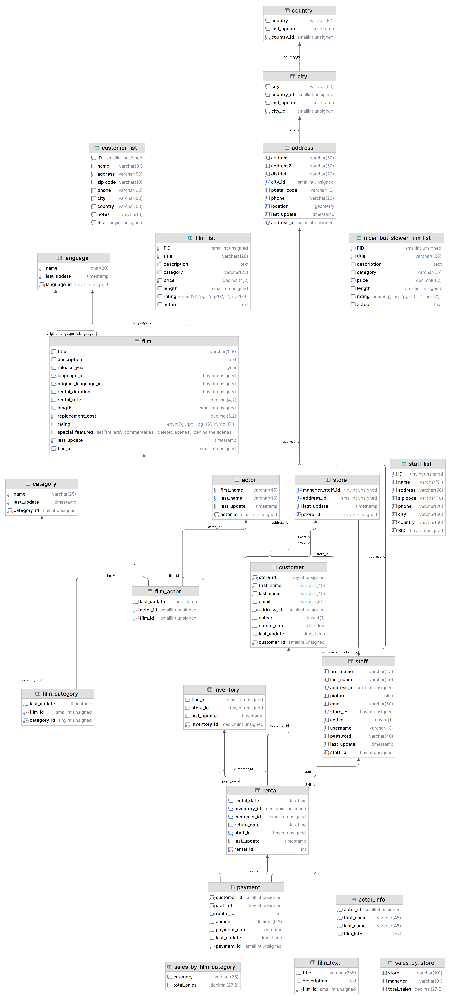
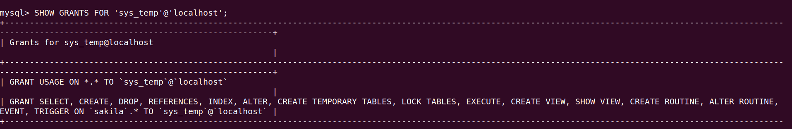

# Домашнее задание к занятию "`Введение в SQL`" - `Левковец Ирина`


### Инструкция по выполнению домашнего задания

   1. Сделайте `fork` данного репозитория к себе в Github и переименуйте его по названию или номеру занятия, например, https://github.com/имя-вашего-репозитория/git-hw или  https://github.com/имя-вашего-репозитория/7-1-ansible-hw).
   2. Выполните клонирование данного репозитория к себе на ПК с помощью команды `git clone`.
   3. Выполните домашнее задание и заполните у себя локально этот файл README.md:
      - впишите вверху название занятия и вашу фамилию и имя
      - в каждом задании добавьте решение в требуемом виде (текст/код/скриншоты/ссылка)
      - для корректного добавления скриншотов воспользуйтесь [инструкцией "Как вставить скриншот в шаблон с решением](https://github.com/netology-code/sys-pattern-homework/blob/main/screen-instruction.md)
      - при оформлении используйте возможности языка разметки md (коротко об этом можно посмотреть в [инструкции  по MarkDown](https://github.com/netology-code/sys-pattern-homework/blob/main/md-instruction.md))
   4. После завершения работы над домашним заданием сделайте коммит (`git commit -m "comment"`) и отправьте его на Github (`git push origin`);
   5. Для проверки домашнего задания преподавателем в личном кабинете прикрепите и отправьте ссылку на решение в виде md-файла в вашем Github.
   6. Любые вопросы по выполнению заданий спрашивайте в чате учебной группы и/или в разделе “Вопросы по заданию” в личном кабинете.
   
Желаем успехов в выполнении домашнего задания!
   
### Дополнительные материалы, которые могут быть полезны для выполнения задания

1. [Руководство по оформлению Markdown файлов](https://gist.github.com/Jekins/2bf2d0638163f1294637#Code)

---

### Задание 1

1.1. Поднимите чистый инстанс MySQL версии 8.0+. Можно использовать локальный сервер или контейнер Docker.

1.2. Создайте учётную запись sys_temp.
```sql
CREATE USER 'sys_temp'@'localhost' IDENTIFIED BY 'password';
```
1.3. Выполните запрос на получение списка пользователей в базе данных. (скриншот)
```sql
SELECT User, Host FROM mysql.user;
```


1.4. Дайте все права для пользователя sys_temp.
```sql
GRANT ALL PRIVILEGES ON *.* TO 'sys_temp'@'localhost';
```
1.5. Выполните запрос на получение списка прав для пользователя sys_temp. (скриншот)


1.6. Переподключитесь к базе данных от имени sys_temp.
```bash
sudo mysql -u sys_temp -p
```
Для смены типа аутентификации с sha2 используйте запрос:
```sql
ALTER USER 'sys_test'@'localhost' IDENTIFIED WITH mysql_native_password BY 'password';
```
1.6. По ссылке https://downloads.mysql.com/docs/sakila-db.zip скачайте дамп базы данных.

1.7. Восстановите дамп в базу данных.
```sql
CREATE DATABASE sakila;
```
```bash
mysql -u sys_temp -p sakila < Downloads/sakila-db/sakila-schema.sql
mysql -u sys_temp -p sakila < Downloads/sakila-db/sakila-data.sql
```
1.8. При работе в IDE сформируйте ER-диаграмму получившейся базы данных. При работе в командной строке используйте команду для получения всех таблиц базы данных. (скриншот)



### Задание 2

| TableName | PrimaryKeyColumn |
| :--- | :--- |
| actor | actor\_id |
| address | address\_id |
| category | category\_id |
| city | city\_id |
| country | country\_id |
| customer | customer\_id |
| film | film\_id |
| film\_actor | actor\_id |
| film\_actor | film\_id |
| film\_category | film\_id |
| film\_category | category\_id |
| film\_text | film\_id |
| inventory | inventory\_id |
| language | language\_id |
| payment | payment\_id |
| rental | rental\_id |
| staff | staff\_id |
| store | store\_id |
---

### Задание 3
3.1. Уберите у пользователя sys_temp права на внесение, изменение и удаление данных из базы sakila.
```sql
REVOKE INSERT, UPDATE, DELETE ON `sakila`.* FROM 'sys_temp'@'localhost';
```
3.2. Выполните запрос на получение списка прав для пользователя sys_temp. (скриншот)
